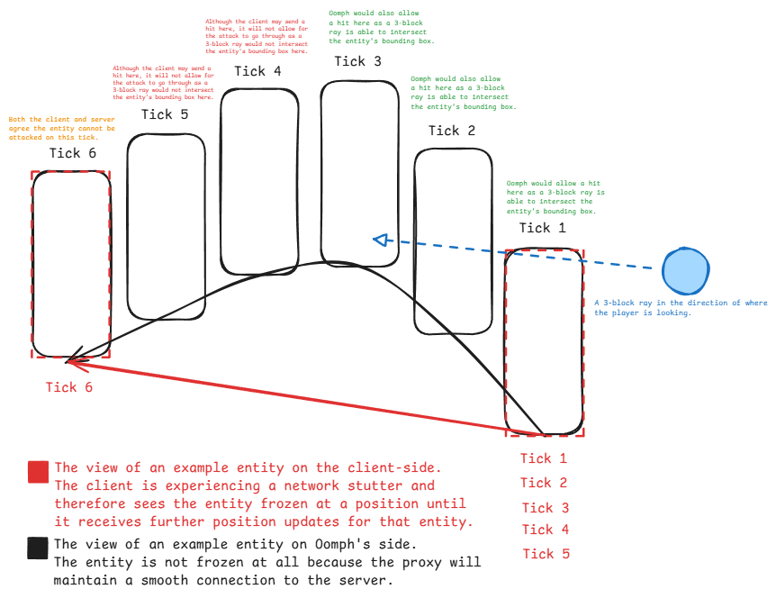

# Oomph
Oomph is a military grade interception based anti-cheat proxy for Minecraft: Bedrock Edition.

## How does Oomph work?
Oomph acts as an intermediary between your server and Minecraft clients, processing all packets sent by the client and the server. It performs various checks on all packets to detect potential cheats.

Oomph implements a server authoritative system for movement and combat, allowing the proxy to mitigate a large variety of common cheats.

## Dependencies
- [Dragonfly](https://github.com/oomph-ac/dragonfly)
- [Spectrum](https://github.com/oomph-ac/spectrum)
- (For your PM server) [Spectrum-PM](https://github.com/oomph-ac/spectrum-pm)
- [OConfig](https://github.com/oomph-ac/oconfig)
The multi-version will not be going public at the moment, you may remove the dependency from `go.mod`.

## Server Authoritative Movement
Similar to what is implemented in BDS, Oomph attempts to replicate the movement of players and send any corrections if deemed neccessary. Unlike BDS, Oomph accounts for latency, making it much smoother than the current vanilla system. As of now, Oomph has known issues with the following:
* Liquids, the client is fully exempted in this scenario.
* Collisions
    - if there is any small position difference between Oomph's authoritative position and the clients. Attempts have been made to reduce this issue by slowly drifting to the position of the client in certain scenarios.
    - if a block's bounding box is not implemented by Dragonfly

Oomph's server authoritative movement system also mitigate any value of timer above 20 ticks per second, making it non-viable for closet and blatant cheaters.

Movement logic and processing can be found in the following files:
* `player/packet.go`
* `player/movement.go`
* `player/component/movement.go`
* `player/component/acknowledgment/movement.go`
* `player/simulation/movement.go`

There are currently no alerts for when a movement mitigation is triggered.

## Server Authoritative Combat
Oomph utilizes a server authoritative combat system to prevent any type of hitbox or reach modification, and also mitigating any type of cheat that harshly abuses traditional lag compensation like in the [reach detection](https://github.com/oomph-ac/oomph/commit/de222dfa27721f42c7497002fbd172c9bbcbb26b) Mineage, Cora, and PotLounge use. However, there is still a way to get this functionality currently, by disabling `FullAuthoritative` in the `oconfig` combat options.

Oomph has a "server" tick and a client tick, and utilizes a position buffer to get an entity's position nearest to that tick. The amount of positions buffered is configurable via. `oconfig`. Whenever the client gives an indication of an attack or missed swing, Oomph will rewind the entity to the exact client tick (or closest, if the tick is not found in the position buffer). 

There are three possible scenarios where Oomph decides to calculate combat on the next PlayerAuthInput packet:
* If the client sends an InventoryTransaction packet, the first one sent will be used to calculate the end result.
* If the client has sent a missed swing flag in the next PlayerAuthInput.
* If the client has sent a start block break action in the next PlayerAuthInput.

(Although it is vanilla behaviour in Bedrock where you can attack as many entities as you can within the 50ms tick period, this system only allows a player to attack one entity per client tick.)

If the client did not send an InventoryTransaction, a check is done to see if the client potentially mispredicted a missed swing, when Oomph thinks it should still be hitting an entity. Oomph will find the closest entity (within 4.5 blocks) to the player and perform any neccessary calculations on that entity.

Oomph attempts to do multiple raycasts to somehow simulate how Bedrock does combat (and other actions) on frame. Although it probably isn't 100% perfect, I felt as if it's as good as it could get. Oomph then ensures that there aren't any blocks intersecting the calculated ray, and if this is the case, it sends an attack packet to the server. If the player is touch/mobile and the raycast fails, Oomph calculates the closest point from the bounding box of the entity to the attacker's eye position. It then ensures that the distance between those two are within range. Of course, an angle validation is required for this as well, and will be worked on in the near future.

Logic for combat, setting the client & server tick, and lag compensating entities can be found in:
* `player/packet.go`
* `player/world.go`
* `player/combat.go`
* `player/component/combat.go`
* `player/component/acknowledgment/entities.go`
* `player/component/acknowledgment/latency.go`
* `player/component/entities.go`
* `entity/entity.go`
* `entity/rewind.go`

## Credits
* [ethaniccc](https://www.github.com/ethaniccc) - Created the systems for validating combat and movement, while keeping lag-compensation in mind.
* [JustTalDevelops](https://github.com/JustTalDevelops) - Created the base of Oomph, making it able to intercept packets, and avoiding pesky import cycle.
* [cjmustard](https://www.github.com/cjmustard) - Moral support

